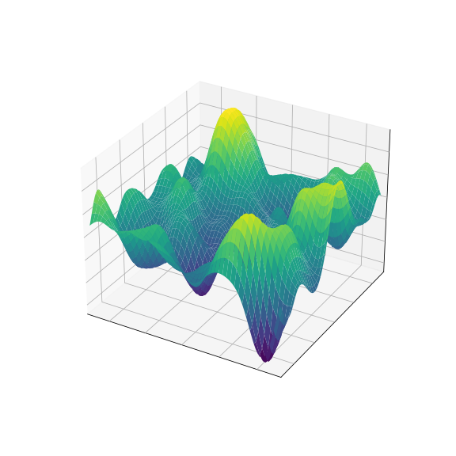
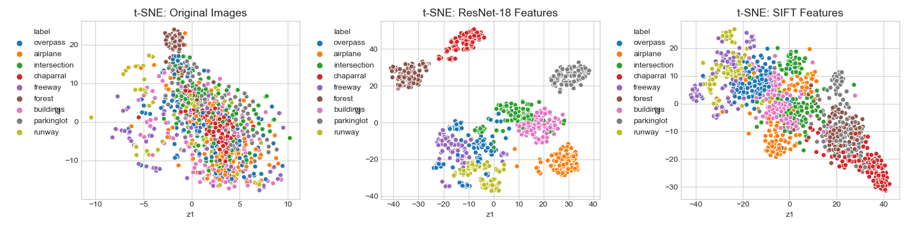

# Gaussian Processes for Aircraft Detection



These experiments test the performance of a Gaussian process (GP) classifier with various kernels on the UC Merced land use land cover (LULC) dataset. The motivation comes from the paper [Gaussian Processes for Object Detection in High Resolution Remote Sensing Images (Liang et al. 2016)](https://ieeexplore.ieee.org/document/7838284), where the authors use a combination of a SIFT or SURF feature extractor and a GP with squared exponential / radial basis function (RBF) kernel to classify aerial images as _airplane / not airplane_. 


The __GP with RBF kernel__ performed best in the original paper but other kernels were not considered. These experiments attempt to reproduce the results from the paper, but also considers additional kernels for the GP to see if they increase/decrease performance. 

Using __SIFT as a feature extractor__ also provided the best results in the original work. However, the embeddings from a pretrained convolutional neural network can be used in lieu of SIFT features. This approach is considered as well by replacing SIFT features with ResNet-18 features being fed into the GP. 


### Run with virtual environment
The settings for the experiment are in `config.yaml`.

#### Set up environment
`pipenv` is used for managing dependencies. Before running any experiments, ensure that `wget` is installed (using `brew install wget` with linux), all packages are installed, and MLflow is set up. Then pull the data from the UC Merced site. This can be done using:


```
# install dependencies and create virtual env
pipenv install 

# setup mlflow
pipenv run sh scripts/setup_mlflow.sh

# get data
sh scripts/get_imagery.sh
```

from the root directory. This will set up the environment and experiments and will create a `data` directory with all of the images.

#### Run experiments
To run multiple experiments with `pipenv` (also from the root directory):

```

pipenv run sh run_batch.sh
```

To run a single experiment with a choice of kernel (ex. Linear kernel):

```
pipenv run python run.py --kernel=Linear_Kernel
```

The full list of kernels used is in the `KERNELS` dictionary in `run.py`.

### Run with Docker

First, ensure that Docker is able to use at least 6 GB of memory. The default 2 GB memory will cause the process to die. Using larger images will require more memory - ex. 150 x 150 images require at least 10 GB of memory and 224 x 224 images require at least 16 GB memory.

Build the container:


```
docker build -t aircraft-detection .
```

Run the container with port mapped to 5000 for MLflow:

```
docker run -it -p 5000:5000 --name aircraft-detection aircraft-detection
```

To run experiments, use the `pipenv run`commands from the previous section.

### Viewing the results in MLflow

To view the results of each experiment, first enter the container if needed:

```
docker start -i aircraft-detection
```

Then use (from the root directory containing `mlruns/`):

```
pipenv run mlflow ui --host 0.0.0.0
```

The MLflow tracking UI will be available locally at `localhost:5000`.



### Note about Cholesky decomposition error

Numerical instability exists in the `DotProduct` kernel [due to rounding errors](https://github.com/scikit-learn/scikit-learn/issues/8252). In our case, this could be due to collinearity in the large number of correlated features. To overcome it, we add a `WhiteKernel` to it with a small noise level. This is equivalent to adding a small number to the diagonal of the covariance matrix, which can also be done using the [nugget](https://stats.stackexchange.com/questions/324825/what-is-the-nugget-effect) of the GP.

